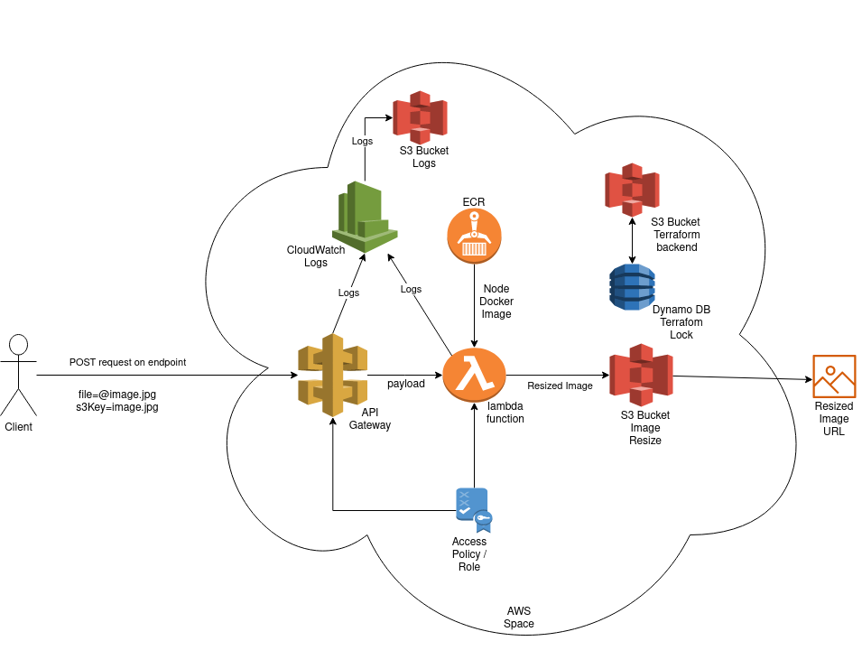
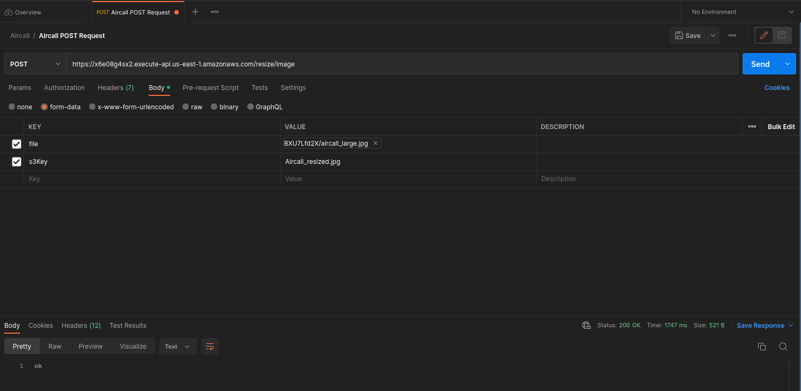

## Introduction

This folder has the documentation needed to describe the cloud architecture, features and processes for the Image resize application using AWS.

## Solution Diagram
Bellow is a diagram of the solution for the given problem:

## Provided

1. CICD basic workflow for development teams.
2. Infrastructure as code basic workflow for provisioning cloud infrastructure
   1. Using OpenIDC authentication;
3. CICD scripts for local testing of resources;
4. Documentation of the solution, print screen and diagram;
5. Infrastructure as code directory with AWS infrastructure provisioning;
   1. Terraform for most of the landing zone;
   2. Cloud formation for IAM role for the OpenIDC (it was much easier to use cloud formation for this specific case although I never used it before);
6. Basic Dockerfile of the solution (No testing or image sizing considerations).

## How to run

Endpoint: https://x6e08g4sx2.execute-api.us-east-1.amazonaws.com/resize/image

Curl command (from root folder):
'''
curl -X POST 'https://x6e08g4sx2.execute-api.us-east-1.amazonaws.com/resize/image' --form 'file=@image-test/aircall_large.jpg' --form 's3Key=Aircall_resized.jpg'
'''

Output S3 Image URL test: https://aircall-image-resize-bucket.s3.amazonaws.com/Aircall_resized.jpg
Output S3 Image URL: https://aircall-image-resize-bucket.s3.amazonaws.com/${s3Key}

Public Repository: 

## Postman API Test

A screenshot of the postman POST api request using an image can be seen bellow with the expected return code 200.

## Documentation Provided:

1. Initial document on the thinking process and design solution for the given problem (mentioning some of the knowns/unknowns).
2. Logging and Monitoring document describing the solution for the logging and monitoring process.
   1. This solution helped to debug configuration issues within the API Gateway.
3. Diagram Folder with illustrative Diagrams of the solution.
4. CICD document with an overview of the deployment framework and cicd process.
5. TODO document with ideas that were not implemented but could add value to the implementation.
