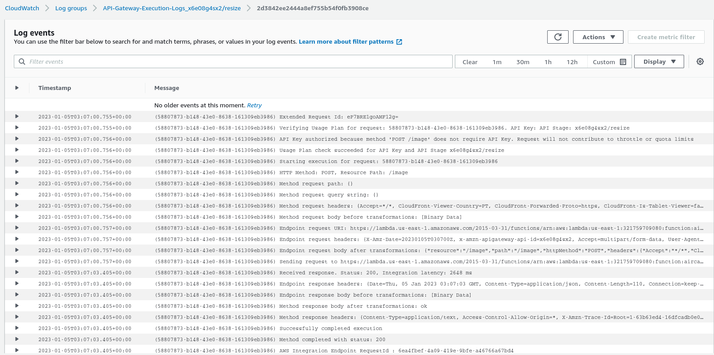
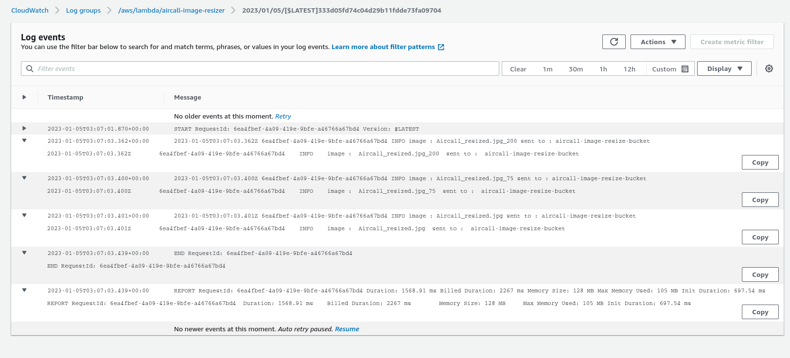
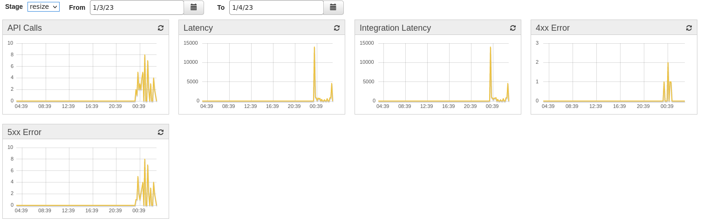
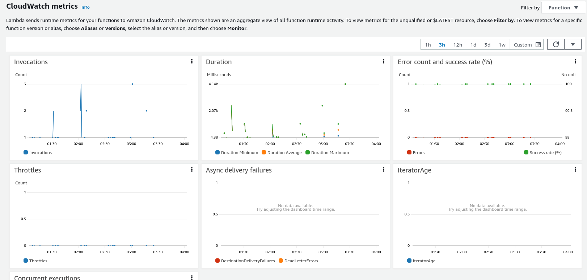

# Summary

Small description of the logging and monitoring configuration.

## Logging and Monitoring
The logging and monitoring can be seen in full detail on Cloudwatch for both the API Gateway and the Lambda function.
It is possible but not on the scope of this project to integrate with services like datadog.

In order to provide samples of logging events there was provided an S3 bucket with some log outputs from the lambda function [link](key.s3)

## Current features that are logged by CloudWatch: 

1. Lambda Function; 
2. API Gateway

## Example Logs

The following print screens are an exemplification of what is being logged per event on the cloud watch platform.

Logs for the API gateway events.

Logs for a successful execution of the function.

## Example Monitoring

The following print screens are an exemplification of what is being monitored on the AWS platform for the API gateway and the lambda function.

Metrics of usage for the API Gateway.

Metrics of usage for the Lambda function.
